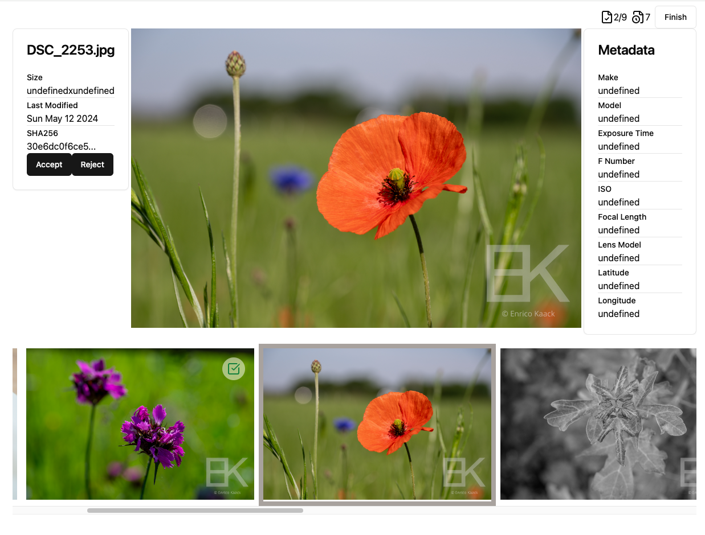
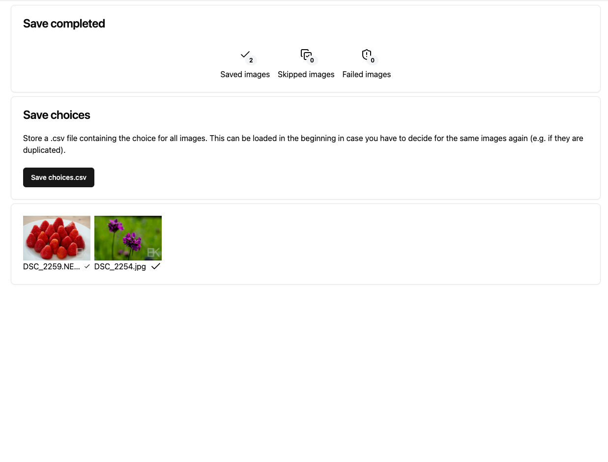

# Photo Sort

## Project Overview

**Photo Sort** is a simple web application designed to help you sort through old pictures quickly and efficiently. Using the browser's File System API, it allows you to load images from an input folder, decide whether to keep or discard each image, and save accepted images to a new output folder. The entire process is done locally within your browser, ensuring that your images never leave your device or get uploaded to a server.

This project is built with React and emphasizes local, client-side processing for privacy and speed.

## Features

- Select an input folder from your local file system.
- Review and accept or reject images one by one.
- Save accepted images to a designated output folder, optionally preserving the original folder structure.
- Deduplication by saving already sorted images to avoid repeated sorting in further session.
- Works fully in the browser using the File System API (compatible with browsers like Google Chrome).
- No images are ever uploaded to a server—processing is entirely local.

## Screenshots



## Local Installation

### Prerequisites

- Node.js
- npm

### Steps to Install

1. Clone the repository:
   ```bash
   git clone https://github.com/enrico-kaack/photo-sort.git
   cd photo-sort
```
2. Install the dependencies:
```bash
npm install
```
3. Start the app
```bash
npm run dev
```

## Usage
1. Open the Photo Sort app in your browser.
1. Recommended: Create a copy/backup of your images.
1. (Optional) Load one or multiple `choices.csv` files if you have already sorted some images and want to skip them.
1. Select an input folder containing the pictures you want to sort. If you get a message that this browser is not supported, please use a different browser, e.g. Google Chrome browser.
1. For each picture, decide whether to accept (keyboard shortcut `p`) or reject (keyboard shortcut `x`) the image.
1. After reviewing all images, choose an output folder where accepted pictures will be copied. You can select to keep the original folder structure.
1. (Optional) You can download a `choices.csv` file saving all your choices. This can later be used when sorting through another folder to automatically skip already accepted and rejected images.

## Technology Stack

- React: For the user interface and managing application state.
- Browser File System API: For handling files locally without the need for a server.
- No Backend: All image sorting and file handling occur on the client side, providing full privacy.

## License

This project is licensed under the MIT License. See the [LICENSE](LICENSE) file for more details.